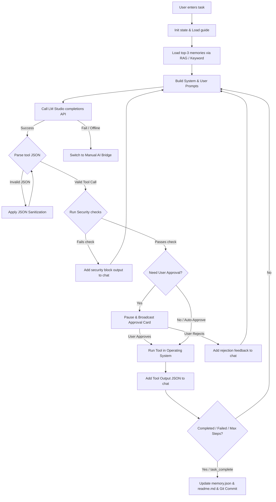

# Core Algorithms & Logic - Local AI Computer Agent

This document explains the algorithms, loops, and mathematical logic used in the Local AI Computer-Use Agent.

---

## 1. Core Agent Execution Loop (`runAgentLoop`)

The main logic in [agent.js](file:///d:/!localAiAgent/aiAgentLocal/src/agent.js) implements a multi-step execution loop that repeatedly invokes the local LLM until the goal is achieved or max steps are reached.



### Safety and Infinite Loop Detection
To prevent models from spinning endlessly on failing commands, the loop tracks the signature of the last 3 failed tool calls:
- Signature: `${toolName}:${JSON.stringify(args)}`
- If 3 identical signatures fail consecutively, the loop automatically terminates to conserve compute and avoid endless prompts.

---

## 2. RAG Vector Memory Similarity

The memory module in [memory.js](file:///d:/!localAiAgent/aiAgentLocal/src/memory.js) searches `config/memory.json` using vectorized search.

### Cosine Similarity Formula
The RAG system calculates cosine similarity between the query embedding vector ($\vec{A}$) and each memory embedding vector ($\vec{B}$):

$$\text{Similarity}(\vec{A}, \vec{B}) = \frac{\vec{A} \cdot \vec{B}}{\|\vec{A}\| \|\vec{B}\|} = \frac{\sum_{i=1}^{N} A_i B_i}{\sqrt{\sum_{i=1}^{N} A_i^2} \sqrt{\sum_{i=1}^{N} B_i^2}}$$

### Logic Flow
1. Fetch current query embedding from LM Studio.
2. If LM Studio is unreachable or does not support embeddings, fall back to keyword frequency indexing (TF-IDF light):
   - Tokenizes the query.
   - Computes intersection frequencies with memory items.
3. Sorts memory entries by highest similarity score.
4. Returns the top 3 items matching a similarity threshold $> 0.5$. If no match is found, returns the 3 most recent records.

---

## 3. Levenshtein Security Filtering

Before executing any terminal command or search query, `src/security.js` verifies the parameters against a list of banned terms.

### Levenshtein Distance Matrix Calculation
To capture obfuscated commands (e.g. `p-o-r-n` instead of `porn`), we calculate the edit distance between command words and banned terms.

Let $D(i, j)$ be the distance between prefix of word $A$ of length $i$ and prefix of word $B$ of length $j$:

$$D(i, j) = \min \begin{cases}
D(i-1, j) + 1 & \text{(Deletion)} \\
D(i, j-1) + 1 & \text{(Insertion)} \\
D(i-1, j-1) + \text{cost} & \text{(Substitution)}
\end{cases}$$

Where $\text{cost} = 0$ if $A[i] = B[j]$, else $1$.

### Optimization to Prevent Event Loop Blocking
Because Levenshtein is $O(N \times M)$ and blocking, checking large directories can cause lags. We optimize it by skipping comparison if the length difference between the two terms is greater than 2:

$$\text{If } |A.\text{length} - B.\text{length}| > 2 \implies \text{Skip Levenshtein comparison}$$

---

## 4. Manual AI Bridge Fallback

When LM Studio communication fails:
1. The backend transitions the agent's status to `manual_bridge`.
2. The current prompt history is flattened into a single readable string format.
3. The dashboard UI displays a guide with links (Gemini, Claude, ChatGPT, Perplexity) and copies the prompt to the clipboard.
4. The backend pauses execution using a Promise resolver:
   ```javascript
   return new Promise((resolve) => {
       manualBridgeResolver = resolve;
   });
   ```
5. When the user pastes the external AI's response, a WS payload of type `manual_ai_response` is dispatched.
6. The backend resolves the promise with the user's input, returning control to the agent loop to evaluate the next step.
